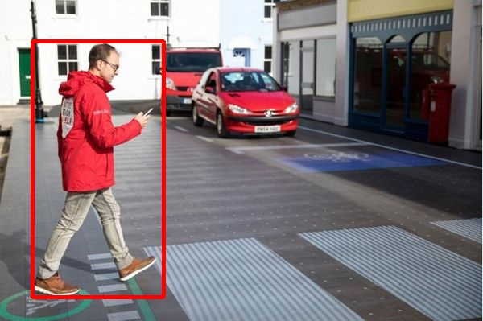

# PedestrianDetection

This is a pedestrian detection interface based on Python + flask framework. Pedestrian object detection model is a yolov3 detection model pre-trained on COCO dataset. This is  the background function implementation code for single picture detection supporting front-end custom Web.

## 1. Requirements

```
python 3.6
tensorflow 1.4.0
keras 2.3.1
matplotlib 3.1.1
opencv-python 4.1.1.26
Pillow 6.2.0
flask 1.1.1
requests 2.22.0
gevent 1.4.0
```

## 2. Directory Structure

```
PedestrianDetection
|__ PedestrianDetectionFunc
|	|__ Data
|	|   |__ coco_classes.txt  
|	|	|__ yolo_anchors.txt  
|	|	|__ model.h5  
|	|__ Model
|	|	|__ model.py  
|	|__ Utils
|		|__ utils.py  
|	|__ PedestrianDetectionClass.py  
|	|__ PedestrianDetectionModel.py
|__ PedestrianDetectionMain.py  
|__ TestCode.py  
|__ VerifyResult.py  
|__ Person.jpg
```

## 3. Quick Start

### 1) Start Background Services

#### start Background Services in Remote Server or Local Command Window

```shell
cd PedestrianDetection  
python PedestrianDetectionMain.py
```

#### desired output

```
PedestrianDetection Net Ready
 * Serving Flask app "PedestrianDetectionMain" (lazy loading)
 * Environment: production
   WARNING: This is a development server. Do not use it in a production deployment.
   Use a production WSGI server instead.
 * Debug mode: off
 * Running on http://localhost:8086/ (Press CTRL+C to quit)
```

### 2) Test Single Picture

#### open another command window
```shell
python TestCode.py
```

#### return the following string if success
```
{"result": "success", "box": ["class_name score left top right bottom"], "time": "xxxms"}
```

#### else return
```
{'result': 'error', 'msg': 'System is busy,try later', 'errorcode': '10004'}
```

### 3) Verify the detection result

```shell
python VerifyResult.py
```

#### a demo of detect the "Person.jpg"

```
{"result": "success", "box": ["person 1.00 40 51 203 369"], "time": "116.90ms"}
```
